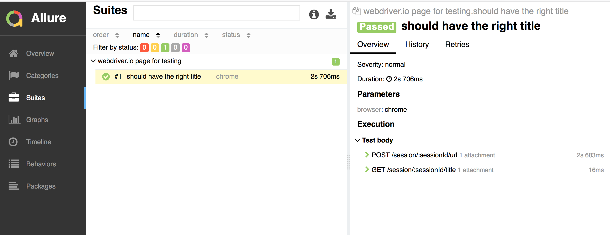

WebDriver TypeScript Allure Reporting
====================================

**Introduction:**

This project is to demonstrate creating a test framework for sample application using wdio
  * IDE Used: **WebStorm** Community Edition
  * Programming language: **typescript**
  * Browser Driver Tool: **Selenium**
  * Build/Dependency Management Tool: **package.json**

**Prerequisties:**

 * node -v 10.0.0 and above
 * npm -v 6.0.0 and above
 * npm install node
 * npm init -y This will generate package.json
 * npm install --save-dev typescript
 * Add tsconfig.json for typescript compilation
 * npm install webdriverio
 * npm i --save-dev @wdio/cli
 * ./node_modules/.bin/wdio config (Generate a configuration file and rename js to ts)
 * Add a allure report using following command :npm install -g allure-commandline --save-dev 
 * Update package.json to run test as under scripts section :wdio ./wdio.conf.ts
 * Update package.json to view report under scripts section :allure generate --clean  [allure_output_dir] && allure open "
 

**Testing Notes:**

* Tested on platform Mac 10.11.6 and browser Chrome 56.0.

**Assumption made**

* 

**Notes**

*

**How to run test:**

* Run tests through command line :
     1.Go to folder location where code is checkout, Run the test using command :npm test.
* Check Reports :
     1.Reports can be seen under samplewebdriverio/allure-report/index.html

